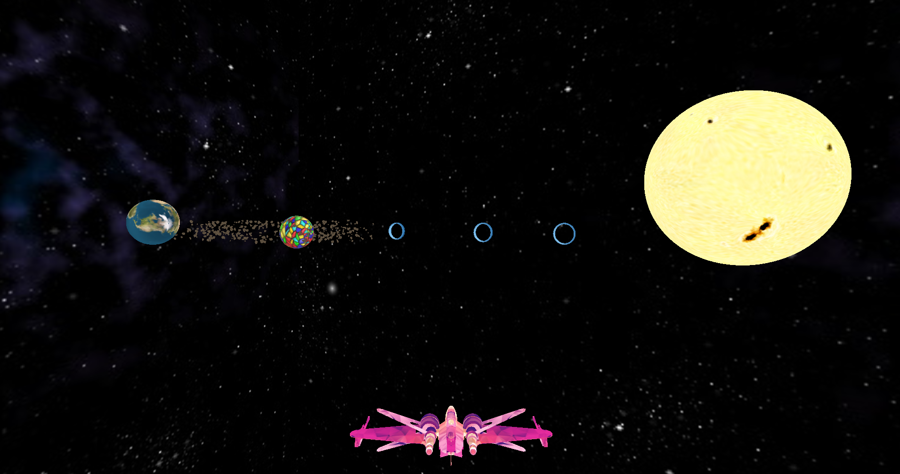
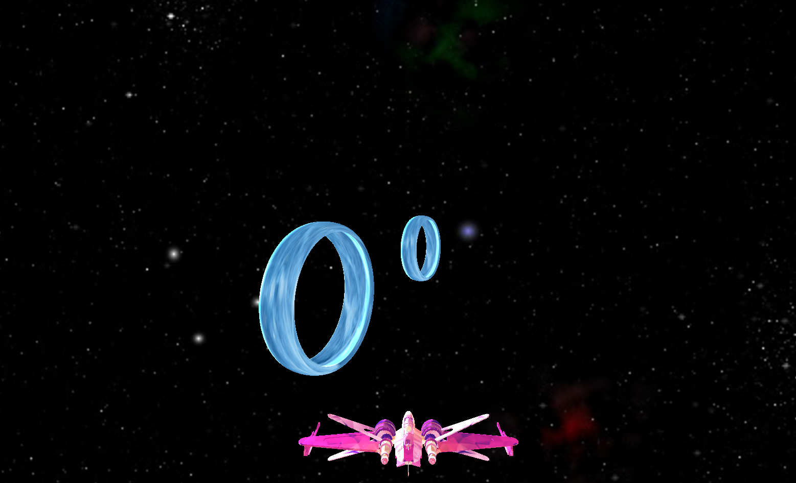
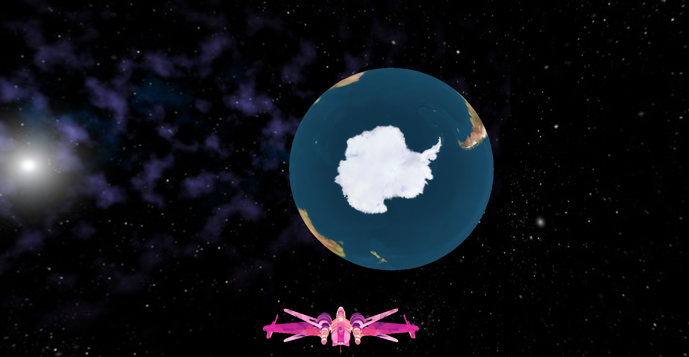
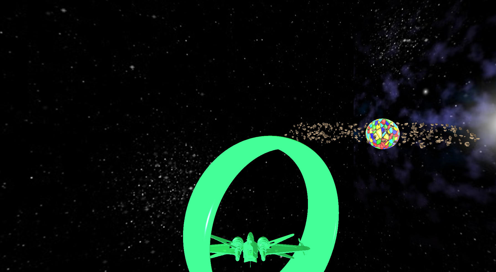
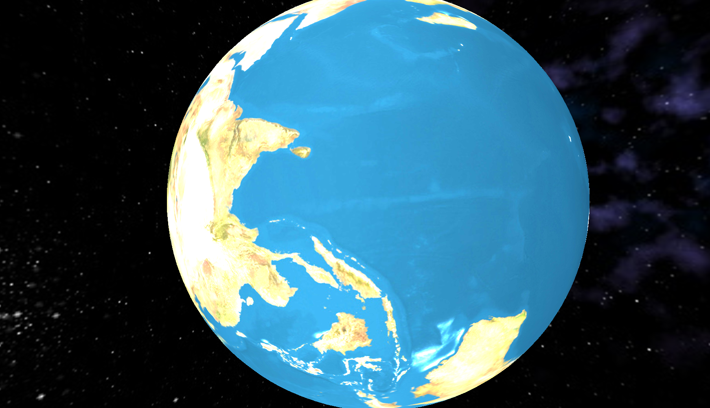
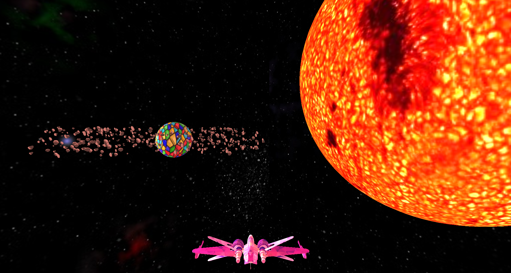

# Rotating-Energy-Rings

*CSCI 3260 Course Project*

## Introduction

In this project, we accomplished all the required features as well as the bonus ones. Recommended libraries (FreeGLUT, GLEW, GLM) are used to implementing solid visual effects.

`camera.h` provides multiple interfaces for camera view adjustment, which is used in keyboard and mouse callbacks to create a rich and interactive scene.

`vertexShaderCode.glsl`, `FragmentShaderCode.glsl` are used for rendering objects, while `skyboxfrag.glsl` and `skyboxvert.glsl` are used for skybos redering.

The overall scene.

## Objects

Asteroid ring cloud consists of floating rocks, which moves around the Wonder star simultaneously.

A close look at the Wonder star.

Energy rings with original texture mapping.

The earth with self-rotation.

## Effects

When the spacecraft is passing through an energy ring, a green testure is applied to both the spacecraft and the energy ring. This is done by calculating the distance between the spacecraft and the center of the energy ring.

[Bonus]Normal mapping for the earth and collision detection. The spacecraft is not rendered in this frame because it overlaps with the earth.

[Bonus] Another light source, red giant featuring red, fierce light, is added.

## Interaction

**Mouse:** 

Control the self-rotation of the spacecraft.

**keyboard:** 

Arrow keys control the translations of the spacecraft. Some more shortcuts are implemented as well.

| Key  | Fuction                                  |
| ---- | ---------------------------------------- |
| 1    | Specular light strength --               |
| 2    | Specular light strength ++               |
| 4    | Diffuse light strength --                |
| 5    | Diffuse light strength ++                |
| 9    | Add red giant as another light source    |
| 6    | Remove red giant as another light source |

